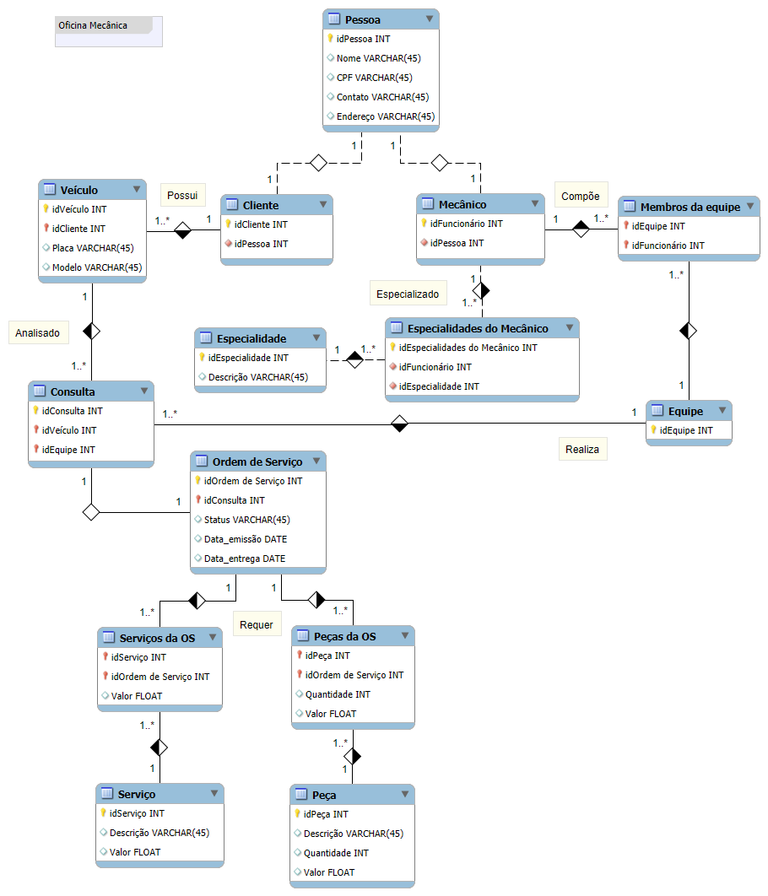

# Construindo um Esquema Conceitual para Banco De dados

O objetivo desse desafio foi desenvolver um modelo de banco de dados para uma oficina mecânica.

Diferente do desafio anterior que foi guiado até certo ponto, esse não houve um guia, tendo que ser desenvolvido desde o início.

**Foi utilizado a seguinte narrativa:**
- Sistema de controle e gerenciamento de execução de ordens de serviço em uma oficina mecânica
- Clientes levam veículos à oficina mecânica para serem consertados ou para passarem por revisões  periódicas
- Cada veículo é designado a uma equipe de mecânicos que identifica os serviços a serem executados e preenche uma OS com data de entrega.
- A partir da OS, calcula-se o valor de cada serviço, consultando-se uma tabela de referência de mão-de-obra
- O valor de cada peça também irá compor a OSO cliente autoriza a execução dos serviços
- A mesma equipe avalia e executa os serviços
- Os mecânicos possuem código, nome, endereço e especialidade
- Cada OS possui: n°, data de emissão, um valor, status e uma data para conclusão dos trabalhos.

**Explicação:**
- Foi criada a entidade Pessoa para a generalização do Cliente e Mecânico
- Um Cliente pode ter mais de um Veículo
- Um Mecânico pode ter várias Especialidades
- Um Mecânico pode fazer parte de mais de uma equipe
- Apenas uma Equipe e um Veículo por OS (Ordem de Serviço)

## Modelo

